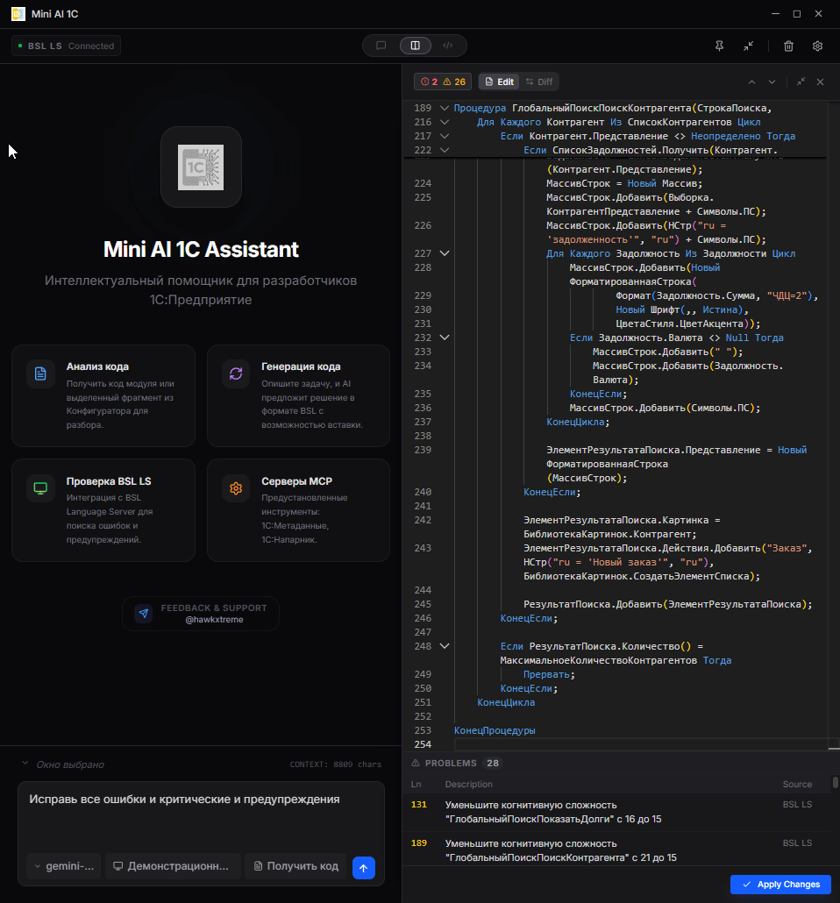
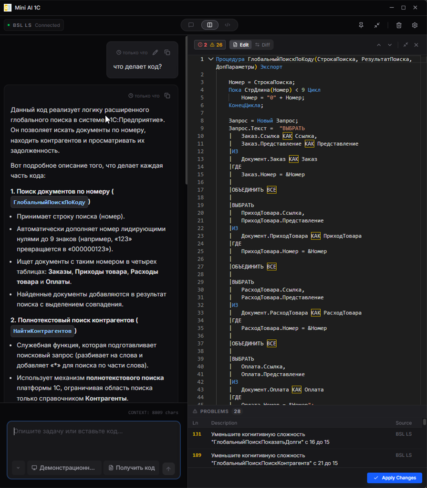
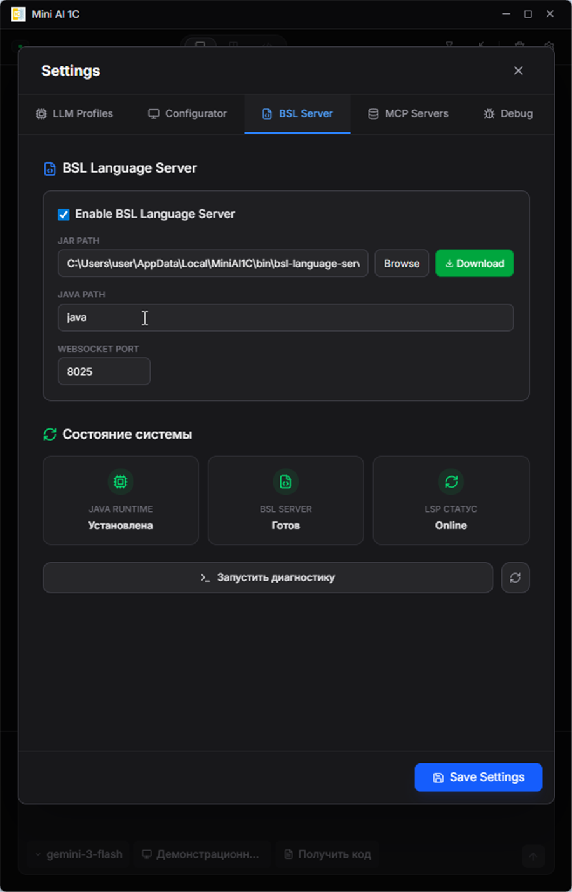
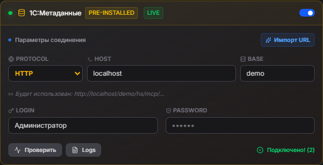
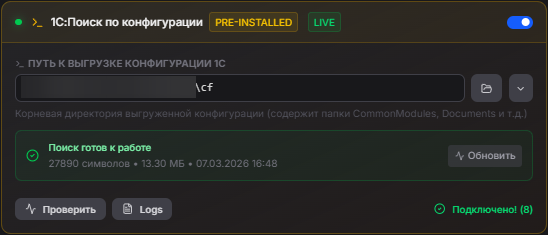

# Mini AI 1C

**Mini AI 1C** — нативный десктопный ИИ-ассистент для разработчиков **1C:Предприятие**, построенный на базе Tauri 2 и React 19. Работает прямо рядом с открытым Конфигуратором: захватывает код модуля, отправляет его ИИ, получает умные правки и вставляет результат обратно.

---

<!-- news:start -->
> ⚠️ **Qwen Code CLI стал платным** (апрель 2026). Бесплатный доступ через OAuth более не работает — токены отклоняются с ошибкой 401.
> Купить подписку: [Alibaba Cloud DashScope](https://dashscope.aliyun.com/) · Или использовать Qwen-модели бесплатно через [Ollama](https://ollama.com/library/qwen2.5-coder) локально.
<!-- news:end -->

<!-- release-news:start -->
> **📋 Последний релиз: версия 1.2.10** — 3 июня 2026
>
> - **Счётчик токенов MCP**: видно, сколько токенов контекста добавляет каждый подключённый MCP-сервер и его инструменты ([#173](https://github.com/hawkxtreme/mini-ai-1c/issues/173))
> - **Блоки кода в чате**: больше не исчезают после завершения ответа модели ([#184](https://github.com/hawkxtreme/mini-ai-1c/issues/184))
> - **Чистый Markdown**: вывод модели очищается от необработанных служебных тегов ([#179](https://github.com/hawkxtreme/mini-ai-1c/issues/179), [#187](https://github.com/hawkxtreme/mini-ai-1c/issues/187))
> - **Путь к search-index**: каталог индекса поиска можно разместить в произвольном месте ([#178](https://github.com/hawkxtreme/mini-ai-1c/issues/178))
> - **Контекст и параметры команд**: исправлено отображение длины контекста ([#182](https://github.com/hawkxtreme/mini-ai-1c/issues/182)) и применение доп. параметров ([#186](https://github.com/hawkxtreme/mini-ai-1c/issues/186))
>
> [Подробнее о релизе →](https://github.com/hawkxtreme/mini-ai-1c/releases/tag/v1.2.10) · [Все релизы →](https://github.com/hawkxtreme/mini-ai-1c/releases)
<!-- release-news:end -->

> 🐛 **Нашли баг или есть вопрос?** Прочитайте [как правильно сообщить о проблеме →](how-to-report-an-issue.md) — там пошагово: что написать, как снять логи приложения и MCP-логи, и готовый шаблон issue.

---

## ⚡ Почему Mini AI 1C?

| | |
|---|---|
| 🆓 **OpenAI Codex CLI** | Авторизуйтесь через браузер и получите доступ к GPT-5.4 с extended thinking — без API-ключей. |
| ☁️ **Ollama Cloud** | Подключайте облачные модели Ollama (qwen3, gpt-oss, deepseek и др.) через API-ключ прямо из профиля LLM. |
| 🤝 **1С:Напарник как ИИ-провайдер** | Прямое подключение к code.1c.ai: ИТС/документация 1С, системные инструкции Mini AI 1C, локальные MCP-tools через адаптер и правки кода в формате SEARCH/REPLACE. |
| 👥 **Несколько аккаунтов** | Переключайтесь между профилями ИИ в один клик: Напарник, Claude, Gemini, GPT — как удобно. |
| 🩺 **BSL Language Server** | Встроенный линтер BSL прямо в редакторе — синтаксические ошибки подсвечиваются до отправки в ИИ. |
| 🔌 **Предустановленные MCP-серверы** | 1С:Справка, 1С:Напарник, 1С:Метаданные, 1С: Поиск по конфигурации — работают «из коробки», без ручной настройки. |
| 🎙️ **Голосовой ввод** | Надиктуйте задачу голосом, не отрывая рук от клавиатуры. |
| 🔗 **EditorBridge** | Надёжное чтение и запись кода в Конфигуратор через UIAutomation + WM_CHAR — без буфера обмена и без конфликтов с хуками 1С. |

---

**1. Получение кода из Конфигуратора и объяснение кода:**


**2. Добавление описания к процедурам и функциям:**


**3. Исправление ошибок BSL:**



---

## 📸 Скриншоты

<details>
<summary>Показать скриншоты</summary>

### Главный экран


---

### Чат и код

<table>
  <tr>
    <td><br/><sub>ИИ-чат с BSL кодом</sub></td>
    <td><br/><sub>Auto-Proof и инлайн-диффы</sub></td>
  </tr>
</table>

---

### Настройки

<table>
  <tr>
    <td><br/><sub>Настройки LLM профиля</sub></td>
    <td><br/><sub>MCP серверы</sub></td>
  </tr>
  <tr>
    <td><br/><sub>BSL Language Server</sub></td>
    <td></td>
  </tr>
</table>

</details>

---

## 🎯 Для чего предназначен

Mini AI 1C создан для **быстрой работы в рамках одного модуля**: рефакторинга, генерации процедур, анализа и исправления кода на BSL.

### ✅ Когда использовать

| Задача | Пример |
|---|---|
| **Генерация кода** | «Напиши СКД-запрос для остатков по складу» |
| **Рефакторинг модуля** | Упростить, переименовать переменные, разбить на функции |
| **Анализ фрагмента** | «Почему эта процедура работает медленно?» |
| **Исправление ошибок** | Автоматически через BSL Language Server |
| **Объяснение кода** | «Что делает этот блок?» |
| **Генерация типовых конструкций** | Запросы, обходы таблиц, HTTP-запросы, XML и т.д. |

### ❌ Когда НЕ использовать

> [!IMPORTANT]
> **Приложение работает только с контекстом текущего модуля.** Оно не имеет доступа к полной структуре вашей конфигурации: составу метаданных, связям между объектами, реквизитам других документов и справочников.

| Ограничение | Что это значит |
|---|---|
| **Нет анализа всей конфигурации** | ИИ не знает, какие объекты есть в вашей базе (если не подключён MCP-сервер «1C:Метаданные») |
| **Нет понимания бизнес-логики** | ИИ не знает о связях между модулями и их назначении |
| **Нет контекста других модулей** | Код в других модулях не виден ИИ (частично снимается MCP-сервером «1С: Поиск по конфигурации») |

💡 **Вывод**: использование MCP-сервера [1C:Метаданные](#1cметаданные) частично снимает эти ограничения, предоставляя ИИ доступ к структуре базы в режиме реального времени.

---

## 🚀 Возможности

- **Онбординг-мастер**:
  - При первом запуске пошаговый мастер настраивает приложение: выбор LLM-провайдера (Codex CLI через браузер, Напарник, или ручной ввод ключа), настройка BSL Language Server, выбор конфигуратора.
  - Онбординг создаёт профиль и активирует его автоматически — сразу после завершения можно работать.

- **Продвинутый ИИ-чат с контекстом**:
  - Обсуждайте ваш код с ИИ, который понимает синтаксис и контекст BSL.
  - **Прозрачность**: наблюдайте за ходом внутренних рассуждений моделей (extended thinking) и выполнением tool calls в реальном времени.
  - **Редактирование сообщений**: измените запрос и перезапустите чат с нужного места.

- **Управление сессиями чата**:
  - Создавайте несколько независимых диалогов и переключайтесь между ними прямо из шапки приложения.
  - История каждого чата сохраняется между перезапусками — возвращайтесь к прерванной задаче в любой момент.
  - Поиск по сохранённым диалогам, переименование, удаление.

- **Интеллектуальная система промптов**:
  - **Профили поведения**: переключайтесь между режимом «Свой код» (свободный рефакторинг) и «Чужой код» (жесткая изоляция правок комментариями).
  - **Библиотека правил**: создавайте свои шаблоны инструкций для ИИ (например, «Всегда использовать БСП» или «Запрет на использование Сообщить()»).
  - **Глобальная роль**: настройте системный префикс (System Prompt) под ваш стиль разработки.

- **Умная маркировка изменений**:
  - Автоматическое выделение правок комментариями `// Доработка START / END`.
  - Гибкая настройка шаблонов с использованием переменных: `{date}`, `{datetime}`, `{newCode}`, `{oldCode}`.

- **Auto-Proof и Интерактивные Диффы**:
  - **Режим Diff (Search/Replace)**: ИИ предлагает точечные изменения, что позволяет работать даже с огромными модулями без потери контекста.
  - **Инлайн-диффы**: визуальное сравнение блоков «ДО/ПОСЛЕ» прямо в чате.
  - **Построчное управление**: принимайте или отменяйте конкретные части кода прямо в редакторе (кнопки «Принять» / «Отменить» на полях Monaco Editor).
  - **Массовое применение**: подтверждайте все изменения разом («Принять всё») или выборочно.
  - **Отмена**: откатите изменения к оригиналу в один клик.

- **Slash-команды**:
  - Встроенная библиотека команд: `/исправить`, `/доработай`, `/рефакторинг`, `/описание`, `/объясни`, `/ревью`, `/стандарты`, `/итс`, `/найти`, `/где`, `/объект`.
  - Каждая команда — готовый промпт-шаблон с переменными `{code}`, `{query}`, `{diagnostics}`.
  - Создавайте собственные команды в разделе **Настройки → Slash-команды**: задайте имя, текст шаблона и включите/отключите по необходимости.

- **Исправление ошибок через BSL LS**:
  - После применения кода запустите slash-команду `/исправить` — ИИ получит диагностики BSL Language Server и исправит синтаксические ошибки.

- **Интеграция с Конфигуратором 1С (Windows)**:
  - **Получить код**: мгновенно забирайте текст модуля или выделенный фрагмент из активного окна Конфигуратора.
  - **Вставить результат**: отправляйте исправленный код обратно в Конфигуратор в один клик.
  - **RDP-режим**: специальный режим для работы через Remote Desktop / терминальный сервер — обходит ограничения на перехват ввода в RDP-сессии.

- **Быстрые действия — всплывающее меню прямо в Конфигураторе** (`Ctrl + ПКМ`):
  - Нажмите **Ctrl + правая кнопка мыши** в любом месте редактора модуля 1С — откроется компактное меню Mini AI 1C.
  - Контекст определяется автоматически: выделен фрагмент → работает с выделением; каретка внутри процедуры → работает с текущим методом; иначе — весь модуль.

  | Действие | Горячая клавиша | Что делает |
  | --- | --- | --- |
  | **Описание** | `F1` | Генерирует комментарий к процедуре/функции по стандарту 1С #std453 и вставляет его перед методом. |
  | **Доработать...** | `F2` | Открывает поле ввода — опишите задачу, ИИ вернёт точечные правки в формате SEARCH/REPLACE. |
  | **Исправить** | `F3` | Получает диагностики BSL Language Server и исправляет синтаксические ошибки в текущем фрагменте. |
  | **Объяснить** | — | Объясняет код: назначение, параметры, логику — результат открывается в основном чате. |
  | **Ревью кода** | — | Проводит код-ревью: критические проблемы, улучшения, производительность, стандарты 1С. |

  После получения результата: **Enter** — применить, **D** — открыть дифф, **Esc** — закрыть.

- **EditorBridge — надёжная интеграция через UIAutomation**:
  - Отдельный нативный компонент **EditorBridge.exe** (.NET, без зависимостей) общается с приложением через Named Pipe (`\\.\pipe\mini-ai-editor-bridge-<USERNAME>`).
  - **Чтение**: UIAutomation TextPattern напрямую читает полный текст модуля, выделение и позицию каретки — без буфера обмена и без влияния на пользователя.
  - **Запись**: метод **PostMessage WM_CHAR** (CP1251) обходит низкоуровневый клавиатурный хук 1С, который блокирует стандартный SendInput/clipboard — единственный надёжно работающий способ вставки кода.
  - **Контекст текущего метода**: автоматически определяет процедуру/функцию под кареткой для точечного применения правок.
  - **Несколько разработчиков на одном сервере**: имя канала по умолчанию включает суффикс `-<USERNAME>`, поэтому терминальные/RDP-сессии разных пользователей не конфликтуют. Имя можно переопределить переменной окружения `MINI_AI_EDITOR_BRIDGE_PIPE` (для нестандартных сценариев).

- **BSL Language Server**:
  - Подсветка синтаксиса и линтинг прямо в редакторе Monaco Editor.
  - Управление BSL LS прямо из настроек: включить, проверить статус, перезапустить.
  - **Встроенная диагностика**: автоматическая проверка доступности Java, JAR-файла и WebSocket-соединения с выводом детальных рекомендаций по устранению проблем.

- **Портативность (True Portability)**:
  - Приложение работает как одиночный `.exe` файл, не требующий установки или наличия папок рядом.
  - Все встроенные MCP-серверы и ресурсы встроены в бинарный файл (`include_bytes!`) и автоматически разворачиваются при первом запуске.

- **Поддержка MCP (Model Context Protocol)**:
  - Подключайте любые внешние MCP-серверы (stdio/SSE).
  - В приложении предустановлены серверы для работы с 1С.

- **🆓 OpenAI Codex CLI — GPT 5.4 через браузерную авторизацию**:
  - Авторизуйтесь через браузер — токен не нужен, OAuth-сессия сохраняется в Keychain.
  - Доступны модели семейства GPT-4o с extended thinking (`reasoning_effort`: low / medium / high / xhigh).
  - Автозагрузка списка доступных моделей из профиля провайдера.

- **1С:Напарник — прямой ИИ-провайдер**:
  - Подключитесь к [code.1c.ai](https://code.1c.ai) по API-токену и общайтесь с ИИ, специализированным на 1С.
  - Встроенный поиск по **ИТС**, документации 1С и коду — без настройки дополнительных MCP-серверов.
  - Системные инструкции Mini AI 1C передаются в Напарник через клиентский адаптер: slash-команды, правила промптов и контекст текущего BSL-кода работают как у обычных LLM-провайдеров.
  - Локальные MCP-инструменты Mini AI 1C доступны Напарнику через единый bridge-tool `Read`; результат локального tool call возвращается модели в следующем шаге диалога.
  - Для правок существующего BSL-кода Напарник возвращает точечные `SEARCH/REPLACE`-блоки, а Mini AI 1C применяет их локально после проверки пользователем.
  - Если модель всё же вернула полный BSL-блок вместо diff, Mini AI 1C распознаёт его как кандидата на замену текущего кода и показывает через тот же локальный diff/apply-механизм.
  - Профиль отображается в отдельной секции «1С:Напарник» в переключателе профилей с оранжевым badge **ИТС**.
  - Ограничение: прямой native `diff/apply` на стороне code.1c.ai не поддерживается; если безопасный текстовый diff построить нельзя, модель должна вернуть полный BSL-блок кода.

- **Гибкое управление LLM**:
  - Поддержка Ollama, **LM Studio**, OpenAI, Anthropic, DeepSeek, OpenRouter и других OpenAI-совместимых провайдеров.
  - Авто-подгрузка списка моделей и проверка связи.

- **Голосовой ввод (Speech-to-Text)**:
  - Надиктуйте задачу голосом — ассистент мгновенно преобразует речь в текст.
  - **Технология**: используется нативный **Web Speech API**, что обеспечивает высокую скорость и работу без дополнительных API-ключей.
  - Полная поддержка русского языка и потоковый ввод текста.

- **Сжатие контекста**:
  - Три стратегии для длинных диалогов: **Выкл** (без сжатия), **Скользящее окно** (сохраняет первое сообщение + последние N), **Суммаризация** (LLM создаёт конспект диалога).
  - Порог срабатывания настраивается (количество сообщений, по умолчанию 40).
  - Суммаризация недоступна для QwenCLI и 1С:Напарника — для них используется fallback без сжатия.

- **Экспорт и импорт настроек**:
  - Перенесите всю конфигурацию (LLM-профили, MCP-серверы, правила промптов, slash-команды) между компьютерами одним файлом.
  - API-ключи, токены и пароли в экспорт **не включаются** — передаются только структурные настройки.
  - Доступно в **Настройки → Основные**.

- Сохранение положения окна между сессиями.

---

## 🔌 Встроенные MCP-серверы

### 1С:Справка


**Описание**: Предоставляет ИИ доступ к официальной справке платформы 1С:Предприятие 8.3. ИИ может мгновенно получать информацию из Синтакс-помощника по методам, свойствам и конструкциям языка BSL, что значительно повышает качество генерации и анализа кода.

**Как подключить**:
1. Перейдите в **Настройки** → **MCP Servers**.
2. В карточке **1С:Справка** переключите тумблер в состояние **Enabled**.
3. При первом запуске приложение автоматически найдет установленную платформу 1С и проиндексирует справку (занимает 1-3 минуты).
4. После завершения индексации статус сменится на **Ready**, отобразив версию платформы и количество проиндексированных тем.

---

### 1C:Напарник (1C.ai)


**Описание**: Доступ к облачному API 1C.ai. ИИ может объяснять сложные моменты BSL, диагностировать код на ошибки и давать рекомендации по стандартам разработки 1С.

> **Новое**: Напарник теперь доступен и как **прямой LLM-провайдер** — помимо использования через MCP. Добавьте профиль в **Настройки** → **LLM** → группа «1С:Напарник» и общайтесь напрямую с поиском по ИТС из коробки.

**Как подключить (MCP-сервер)**:
1. Перейдите в **Настройки** → **MCP Servers**.
2. В карточке **1C:Напарник** введите ваш персональный API Token (получить на [code.1c.ai](https://code.1c.ai) → Профиль → API токен).
3. Переключите тумблер в состояние **Enabled** и нажмите **Проверить**.

---

### 1C:Метаданные



**Описание**: Даёт ИИ возможность исследовать структуру вашей конкретной базы — состав справочников, документов, реквизиты, табличные части, перечисления. Позволяет генерировать код, который сразу готов к работе с вашими данными. Снимает основное ограничение приложения.

Использует HTTP-сервисы расширения [1c_mcp](https://github.com/vladimir-kharin/1c_mcp).

**Как подключить**:
1. Установите расширение `1c_mcp` в вашу информационную базу.
2. Опубликуйте базу на веб-сервере (Apache или IIS).
3. В настройках укажите протокол, адрес сервера и имя публикации.
4. Введите логин/пароль пользователя 1С.
5. Нажмите **Проверить** — статус должен смениться на зелёный чек.

---

### 1С: Поиск по конфигурации



**Описание**: Высокопроизводительный сервер для поиска и навигации по исходным кодам конфигураций 1С:Предприятие (выгрузка в файлы). Работает с конфигурациями 20 ГБ+ даже на медленных HDD: поиск символов — 1–23 мс, полнотекстовый grep — ~77 мс.

**Как подключить**:

1. Перейдите в **Настройки** → **MCP Servers**.
2. В карточке **1С: Поиск по конфигурации** укажите путь к директории с исходниками конфигурации (`ONEC_CONFIG_PATH`).
3. Переключите тумблер в **Enabled** — сервер проиндексирует файлы при первом запуске.

📖 Подробнее: производительность, архитектура, алгоритмы — в [документации сервера](tauri-app/mcp-1c-search/README.md).

---

## 🛠 Технологический стек

| Слой | Технологии |
|---|---|
| **Frontend** | React 19, TypeScript, TailwindCSS, Vite, Monaco Editor |
| **Backend/Core** | Tauri 2 (Rust) |
| **Language Server** | BSL Language Server (WebSocket/Stdio) |
| **AI Integration** | MCP Client, OpenAI-совместимый API, SSE-стриминг |
| **Windows** | Win32 API, UIAutomation, Mouse Hook (интеграция с Конфигуратором) |

## 📋 Требования

1. **Node.js** (v18+) — необходим для работы MCP-серверов.
2. **Java Runtime Environment (JRE)** (v17+) — необходим для работы BSL Language Server.
3. **Windows 10/11** — для полноценной интеграции с Конфигуратором 1С.

## ⚡ Установка и Запуск (Development)

```bash
# 1. Клонируйте репозиторий
git clone https://github.com/hawkxtreme/mini-ai-1c
cd mini-ai-1c/tauri-app

# 2. Установите зависимости
npm install

# 3. Запустите в режиме разработки
npm run app:dev
```

## 📦 Сборка (Production)

```bash
npm run app:build
```
Файлы сборки будут находиться в `src-tauri/target/release/bundle`.

## 🔧 Настройка

- Нажмите иконку **Настройки** (шестерёнка) в приложении.
- Настройте профили LLM и укажите пути к Java/BSL LS.
- В разделе **MCP Servers** подключите дополнительные инструменты.

## ⚠️ Известные проблемы

### Ошибка «Could not find the WebView2 Runtime»

**Причина**: Отсутствует Microsoft Edge WebView2 Runtime — компонент для работы Tauri-приложений на Windows.

**Решение**: Скачайте и установите [WebView2 Runtime Evergreen Bootstrapper](https://go.microsoft.com/fwlink/p/?LinkId=2124703).

> **Примечание**: WebView2 Runtime устанавливается один раз и работает для всех приложений на базе Tauri/Electron.

## 📄 Лицензия

Проект распространяется под кастомной лицензией **(Attribution Non-Commercial License)**. 
- ❌ **Запрещено** коммерческое использование.
- ✅ **Обязательно** указание авторства: `@hawkxtreme`.

Подробности в файле `LICENSE`.

## 🤝 Благодарности

- **Владимир Харин ([@vladimir-kharin](https://github.com/vladimir-kharin))** — за расширение [1c_mcp](https://github.com/vladimir-kharin/1c_mcp), которое легло в основу интеграции с метаданными 1С.
- **[@alkoleft](https://github.com/alkoleft)** — за грамматику [tree-sitter-bsl](https://github.com/alkoleft/tree-sitter-bsl), используемую для парсинга BSL-кода в MCP-сервере поиска по конфигурации.
- **[@Arman-Kudaibergenov](https://github.com/Arman-Kudaibergenov)** — за проект [bsl-atlas](https://github.com/Arman-Kudaibergenov/bsl-atlas), послуживший источником вдохновения для построения индекса символов и call graph BSL.
- **[@SteelMorgan](https://github.com/SteelMorgan)** — за проект [spring-mcp-1c-copilot](https://github.com/SteelMorgan/spring-mcp-1c-copilot), идеи из которого были использованы при разработке MCP 1С Напарника.

---

## 📰 Публикации

<a href="https://infostart.ru/1c/articles/2639822/">
  
</a>

- [Mini AI 1C — ИИ-ассистент для разработчиков 1С](https://infostart.ru/1c/articles/2639822/) — статья на Infostart

---

---

*Создано с ❤️ для сообщества 1С · [Telegram](https://t.me/hawkxtreme)*
